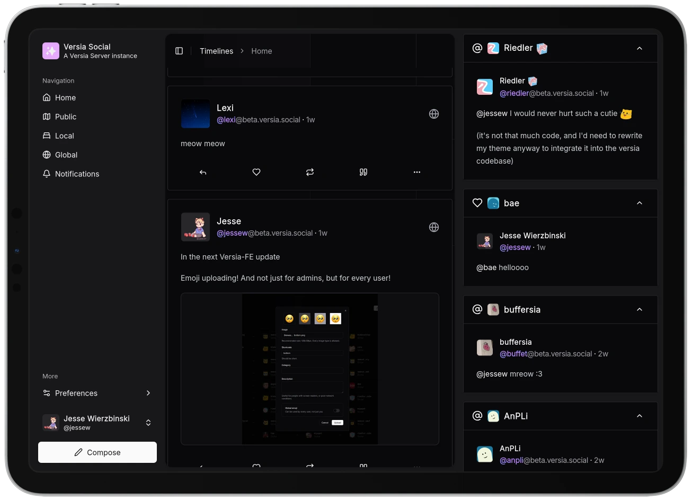

<div align="center">
    <a href="https://versia.pub">
        <picture>
            <source media="(prefers-color-scheme: dark)" srcset="https://cdn.versia.pub/branding/logo-dark.svg">
            <source media="(prefers-color-scheme: light)" srcset="https://cdn.versia.pub/branding/logo-light.svg">
            
        </picture>
    </a>
</div>


<h2 align="center">
  <strong><code>Versia Frontend</code></strong>
</h2>

<div align="center">
    
    
    
    
    
    
    
    
    
</div>


<br/>

<div align="center">
    <picture>
        <source media="(prefers-color-scheme: dark)" srcset="assets/ipad-dark.webp">
        <source media="(prefers-color-scheme: light)" srcset="assets/ipad-light.webp">
        
    </picture>
</div>

# Features

- [x] Timelines: public, home, local
- [x] Login
- [x] Notifications
- [x] Replies
- [x] Quotes
- [x] Markdown posts (quasi-unrestricted)
- [x] Dark mode
- [x] Following
- [x] Multiple accounts
- [x] Custom Emojis
- [x] Versia Server Permissions support
- [x] Note editing
- [x] Alt text support everywhere
- [x] Media uploads
- [x] WCAG 2.2 AAA testing
- [x] Settings
- [x] Profile editing

## Browser Support

The following browsers are **supported** (issues will be prioritized):
- **Chromium**: `110+`
- **Firefox**: `110+`
- **Safari**: `16+`
- **IE**: None.

The following browsers will very likely work, but are not officially supported:
- **Chromium**: `80+`
- **Firefox**: `80+`
- **Safari**: `12+`
- **IE**: None.

Other browsers may work, but are not guaranteed to.

# Performance

## JavaScript

The **total** JavaScript bundle size is less than `1000 kB`, but this is made even smaller by the fact that the bundle is split into multiple files, and only the necessary files are loaded on each page.

## Benchmarks

Soon™.

# Installation

Versia-FE is included in the provided `docker-compose` file during [Versia Server installation](https://github.com/versia-pub/server/blob/main/docs/installation.md).

To have Versia-FE and Versia Server running on the same domain, edit the Versia Server configuration to point to the Versia-FE container's address (`frontend` category inside config).

## Manual Installation

Here are the steps to install Versia-FE manually:

### Docker/Podman

```yaml
services:
    fe:
        image: ghcr.io/versia-pub/frontend:main
        container_name: versia-fe
        restart: unless-stopped
        networks:
            - versia-net
```

Then, the frontend will be available at `http://localhost:3000` inside the container.

> [!TIP]
>
> By default, Versia-FE will connect to any Versia Server instance running on the same domain.
>
> You can set the `NUXT_PUBLIC_API_HOST` environment variable to point to a different Versia Server instance.

### Manual

1. Clone the repository.
```bash
git clone https://github.com/versia-pub/frontend.git
```
2. Install dependencies.
```bash
bun install
```
3. Build the project.
```bash
bun run build
```
4. Serve the static files in the `.output/public` directory.
> [!WARNING]
>
> `.output/public/200.html` should be configured as a fallback for all 404 errors.

# Development

Run `bun run emojis:generate` to generate the emoji list before building or running the project.

# License

This project is licensed under the AGPL 3.0 - see the [LICENSE](LICENSE) file for details.

All Versia assets (icon, logo, banners, etc) are licensed under [CC-BY-NC-SA-4.0](https://creativecommons.org/licenses/by-nc-sa/4.0).

## Misskey Audio

The `public/packs/audio/misskey` directory contains audio files from the Misskey project, which are licensed under the [AGPL 3.0](https://github.com/misskey-dev/misskey/blob/refs/heads/develop/LICENSE).

# Acknowledgments

## Projects

- [**Bun**](https://bun.sh): Thanks to the Bun team for creating an amazing JavaScript runtime.
- [**Nuxt**](https://nuxt.com): Thanks to the Nuxt team for creating an amazing Vue framework.

## People

- [**April John**](https://github.com/cutestnekoaqua): Creator and maintainer of the Versia Server ActivityPub bridge.
